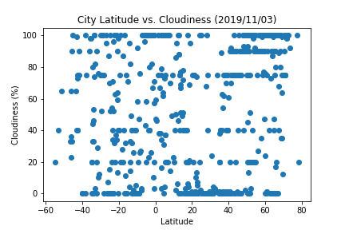
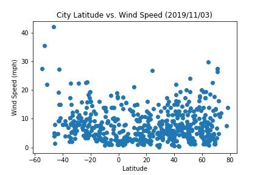

# WeatherPy

## **Objective:**
The objective of this project is to analyze how the weather changes as you approach the equator. To complete this analysis, weather data of 500 random cities was obtained using the OpenWeatherMap API and Matplotlib was used to plot the maximum temperature, humidity, cloudiness, and wind speed vs. latitude. A list of random cities was created by generating a set of random latitude and longitude combinations and identifying the nearest city for each combination using the Citipy Python library. 

## **Tools:**
1. Python -  Matplotlib, Pandas, Numpy, Citipy
2. OpenWeatherMap API

## **Screenshots:**

